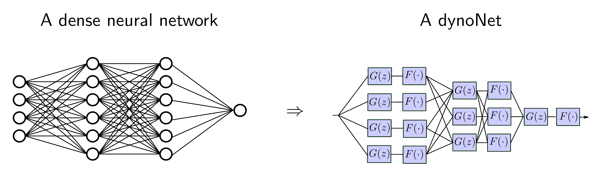

# dynoNet: A neural network architecture for learning dynamical systems 

This repository contains the Python code to reproduce the results of the paper "dynoNet: A neural network architecture for learning dynamical systems"
by Marco Forgione and Dario Piga.

In this work, we introduce the linear dynamical operator as a differentiable layer compatible with back-propagation-based training. 
The operator is parametrized as a rational transfer function and thus can represent an infinite impulse response (IIR)
filtering operation, as opposed to the Convolutional layer of 1D-CNNs that is equivalent to finite impulse response (FIR) filtering.

In the dynoNet architecture, linear dynamical operators are combined with static (i.e., memoryless) non-linearities which can be either elementary
activation functions applied channel-wise; fully connected feed-forward neural networks; or other differentiable operators. 




# Folders:
* [torchid](torchid):  PyTorch implementation of the linear dynamical operator (aka G-block in the paper) used in dynoNet
* [examples](examples): examples using dynoNet for system identification 
* [util](util): definition of metrics R-square, RMSE, fit index 

Three [examples](examples) discussed in the paper are:

* [WH2009](examples/WH2009): A circuit with Wiener-Hammerstein behavior. Experimental dataset from http://www.nonlinearbenchmark.org
* [BW](examples/BW): Bouc-Wen. A nonlinear dynamical system describing hysteretic effects in mechanical engineering. Experimental dataset from http://www.nonlinearbenchmark.org
* [EMPS](examples/EMPS): A controlled prismatic joint (Electro Mechanical Positioning System). Experimental dataset from http://www.nonlinearbenchmark.org

For the [WH2009](examples/WH2009) example, the main scripts are:

 *  ``WH2009_train.py``: Training of the dynoNet model
 *  ``WH2009_test.py``: Evaluation of the dynoNet model on the test dataset,  computation of metrics.
  
Similar scripts are provided for the other examples.

NOTE: the original data sets are not included in this project. They have to be manually downloaded from
http://www.nonlinearbenchmark.org and copied in the data sub-folder of the example.
# Software requirements:
Simulations were performed on a Python 3.7 conda environment with

 * numpy
 * scipy
 * matplotlib
 * pandas
 * pytorch (version 1.4)
 
These dependencies may be installed through the commands:

```
conda install numpy scipy pandas matplotlib
conda install pytorch torchvision cudatoolkit=10.2 -c pytorch
```

# Citing

If you find this project useful, we encourage you to

* Star this repository :star: 
* Cite the [paper](https://onlinelibrary.wiley.com/doi/abs/10.1002/acs.3216) 
```
@article{forgione2021dyno,
  title={\textit{dyno{N}et}: A neural network architecture for learning dynamical systems},
  author={Forgione, M. and Piga, D.},
  journal={International Journal of Adaptive Control and Signal Processing},
  volume={35},
  number={4},
  pages={612--626},
  year={2021},
  publisher={Wiley}
}
```
